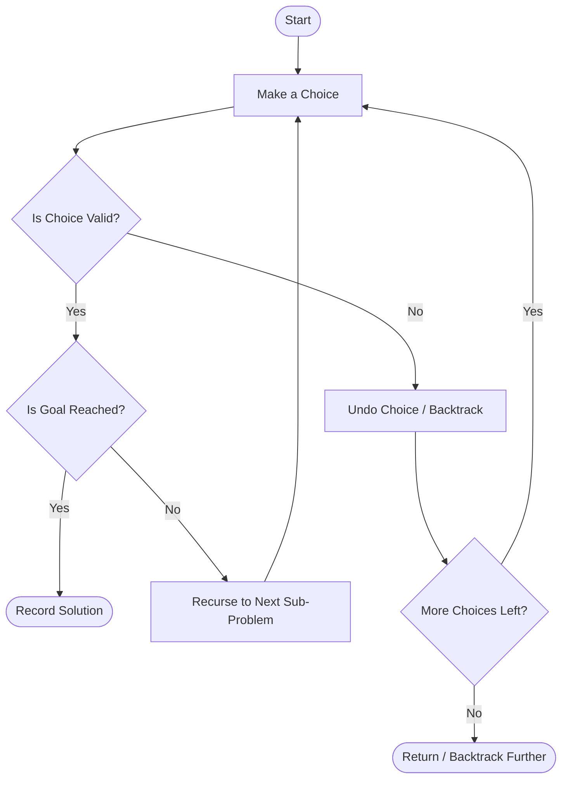
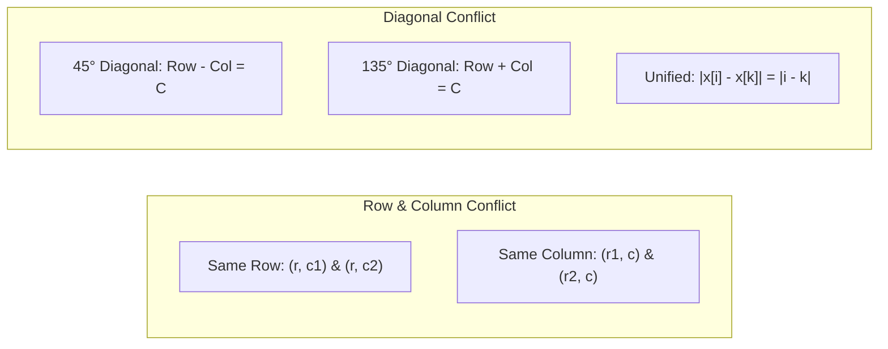
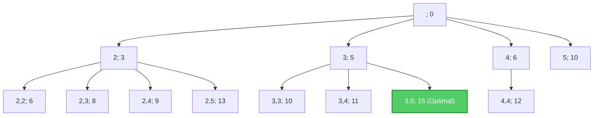
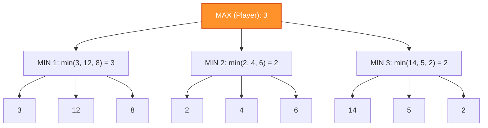
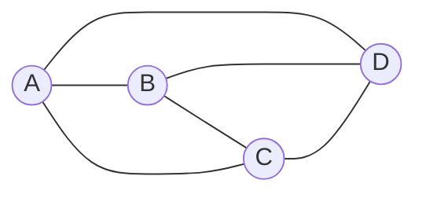

# Unit - 6
:::info[TITLE]
## Backtracking & Branch and Bound
:::

import Tabs from '@theme/Tabs';
import TabItem from '@theme/TabItem';

## 1. Introduction to Backtracking

### 1.1 Core Concept and Philosophy
**Backtracking** is a systematic, general algorithmic technique that considers searching every possible combination in order to solve an optimization or constraint-satisfaction problem.
- **Recursive Technique**: Builds candidates for solutions incrementally and abandons a candidate ("backtracks") as soon as it determines that the candidate cannot lead to a valid solution.
- **Trial and Error**: If a sub-problem attempt fails to reach a feasible or optimal solution, we **undo** the preceding step (backtrack) and try an alternative branch.
- **Search Strategy**: Traverses the **State Space Tree** in **Depth-First Search (DFS)** order.



### 1.2 State Space Tree and DFS Traversal
- **State Space Tree**: A tree representing all possible configurations (partial and complete candidate solutions) of the problem.
  - **Root**: Initial state before making any choices.
  - **Internal Nodes**: Partial solutions under construction.
  - **Leaf Nodes**: Complete configurations (either valid solutions or dead-ends).
  - **Live Node**: A node that has been generated and whose children have not yet been completely explored.
  - **E-Node (Expansion Node)**: The live node currently being explored.
  - **Dead Node**: A generated node that cannot be expanded further or has been pruned.

### 1.3 Explicit vs. Implicit Constraints
All constraint-satisfaction problems require two distinct categories of constraints:

| Constraint Type | Definition | Example in N-Queens | Example in Knapsack |
| :--- | :--- | :--- | :--- |
| **Explicit Constraints** | Rules that restrict each vector component $x_i$ to take values strictly from a predefined domain $S_i$. Independent of other components. | $x_i \in \{1, 2, \dots, n\}$ (queen $i$ must be placed in a valid column). | $x_i \in \{0, 1\}$ (an item is either taken or left behind). |
| **Implicit Constraints** | Relational criteria that determine whether the selected tuple satisfies the problem's objective and rules. Depends on interactions between components. | No two queens share the same row, column, or diagonal: $x_i \ne x_j$ and $\|x_i - x_j\| \ne \|i - j\|$. | Total weight cannot exceed capacity: $\sum w_i x_i \le W$. |

### 1.4 General Backtracking Algorithm Schema

```text showLineNumbers
procedure backtrack(k)
    for each element x[k] in Domain(k) do
        if isValid(x[1..k]) then
            if k == n then
                write(x[1..n])  // Solution found
            else
                backtrack(k + 1)
```

## 2. The N-Queens Problem

### 2.1 Problem Definition
The **$N$-Queens Problem** consists of placing $N$ chess queens on an $N \times N$ chessboard such that **no two queens attack each other**.
- In chess, a queen can move any number of squares horizontally, vertically, or diagonally.
- Therefore, no two queens can share the **same row**, the **same column**, or the **same diagonal**.

### 2.2 Attack Conditions and Conflict Formulas
Let row indices be $i, k \in \{1, \dots, N\}$, and let $x[i]$ represent the column where the queen in row $i$ is placed:

1. **Same Row Conflict**:
   - Prevented inherently by placing exactly one queen per row (each row $i$ has exactly one $x[i]$).
2. **Same Column Conflict**:
   $$
   x[i] = x[k]
   $$
3. **Same Diagonal Conflict**:
   - **$45^\circ$ Diagonal** (slope $+1$): $Row - Col = \text{constant} \implies i - x[i] = k - x[k]$
   - **$135^\circ$ Diagonal** (slope $-1$): $Row + Col = \text{constant} \implies i + x[i] = k + x[k]$
   - **Unified Absolute Formula**:
     $$
     |x[i] - x[k]| = |i - k|
     $$



### 2.3 $k$-Promising Solutions
- **Definition**: A placement of $k$ queens ($1 \le k \le N$) in the first $k$ rows is called **$k$-promising** if none of the $k$ queens threaten each other.
- An **$N$-promising** placement represents a complete, valid solution to the $N$-Queens problem.
- A **$0$-promising** state is an invalid configuration where a conflict already exists, prompting immediate backtracking.

### 2.4 Solutions Count Table for Different $N$

| Number of Queens ($N$) | Board Size | Total Configurations ($N^N$) | Valid Solutions Count |
| :---: | :---: | :---: | :---: |
| **1** | $1 \times 1$ | 1 | **1** |
| **2** | $2 \times 2$ | 4 | **0** |
| **3** | $3 \times 3$ | 27 | **0** |
| **4** | $4 \times 4$ | 256 | **2** |
| **5** | $5 \times 5$ | 3,125 | **10** |
| **6** | $6 \times 6$ | 46,656 | **4** |
| **7** | $7 \times 7$ | 823,543 | **40** |
| **8** | $8 \times 8$ | 16,777,216 | **92** |
| **9** | $9 \times 9$ | $3.87 \times 10^8$ | **352** |
| **10** | $10 \times 10$ | $10^{10}$ | **724** |

## 3. The 4-Queens Problem Walkthrough

### 3.1 $4 \times 4$ Chessboard Analysis
On a $4 \times 4$ board, there are exactly **2 distinct valid solutions**:
1. Solution 1: $\langle 2, 4, 1, 3 \rangle$
   - Row 1 $\to$ Column 2
   - Row 2 $\to$ Column 4
   - Row 3 $\to$ Column 1
   - Row 4 $\to$ Column 3
2. Solution 2: $\langle 3, 1, 4, 2 \rangle$
   - Row 1 $\to$ Column 3
   - Row 2 $\to$ Column 1
   - Row 3 $\to$ Column 4
   - Row 4 $\to$ Column 2

```mermaid
graph TD
    subgraph Solution 1: <2, 4, 1, 3>
        R1C2["Row 1: Col 2"] --- R2C4["Row 2: Col 4"]
        R2C4 --- R3C1["Row 3: Col 1"]
        R3C1 --- R4C3["Row 4: Col 3"]
    end
    subgraph Solution 2: <3, 1, 4, 2>
        S1C3["Row 1: Col 3"] --- S2C1["Row 2: Col 1"]
        S2C1 --- S3C4["Row 3: Col 4"]
        S3C4 --- S4C2["Row 4: Col 2"]
    end
```

### 3.2 Promising States and Vector Representations
Let us trace the derivation of $\langle 2, 4, 1, 3 \rangle$:
- **1-Promising**: Place $Q_1$ at $(1, 2) \implies sol = [2, 0, 0, 0]$
- **2-Promising**: Try row 2:
  - $(2, 1) \implies$ diagonal conflict with $(1, 2)$ ($2-1 = 1 \ne 1-2$, but $|2-1| = |1-2| = 1$)
  - $(2, 2) \implies$ same column conflict
  - $(2, 3) \implies$ diagonal conflict ($|2-1| = |3-2| = 1$)
  - $(2, 4) \implies$ **safe!** $\implies sol = [2, 4, 0, 0]$
- **3-Promising**: Try row 3:
  - $(3, 1) \implies$ **safe!** $\implies sol = [2, 4, 1, 0]$
- **4-Promising**: Try row 4:
  - $(4, 1) \implies$ col conflict
  - $(4, 2) \implies$ col conflict
  - $(4, 3) \implies$ **safe!** $\implies sol = [2, 4, 1, 3]$ (Valid Solution)

### 3.3 State Space Tree Tracing
The complete 4-Queens State Space Tree contains $4^4 = 256$ leaf nodes under brute force, but backtracking prunes most nodes early:
- Placing $Q_1$ at column 1 leads to dead ends in row 3, forcing backtracks to try $Q_1$ at column 2.
- The two branches that reach leaf level $k = 4$ are paths $2 \to 4 \to 1 \to 3$ and $3 \to 1 \to 4 \to 2$.

## 4. N-Queens Algorithm and Implementation

### 4.1 Recursive Queens Algorithm (Slide Pseudocode)

```text showLineNumbers
procedure queens(k, col, diag45, diag135)
    {sol[1..k] is k-promising,
     col = {sol[i] | 1 <= i <= k},
     diag45 = {sol[i] - i + 1 | 1 <= i <= k}, and
     diag135 = {sol[i] + i - 1 | 1 <= i <= k}}
    if k = n then
        write sol
    else
        for j <- 1 to n do
            if j not in col and (j - k) not in diag45 and (j + k) not in diag135 then
                sol[k + 1] <- j
                queens(k + 1, col U {j}, diag45 U {j - k}, diag135 U {j + k})
```

### 4.2 Complexity Analysis
- **Time Complexity**: Upper bounded by $O(N!)$. While a brute-force search evaluates $O(N^N)$ configurations, backtracking checks only permutations ($N!$) and aggressively prunes conflicting diagonal branches early.
- **Space Complexity**: $O(N)$ auxiliary space for the recursive call stack and tracking arrays for columns and diagonals.

### 4.3 Multi-Language Implementation

<Tabs>
  <TabItem value="cpp" label="C++">
    ```cpp showLineNumbers
    #include <iostream>
    #include <vector>
    #include <cmath>
    using namespace std;

    bool isSafe(int row, int col, const vector<int>& sol) {
        for (int i = 1; i < row; i++) {
            if (sol[i] == col || abs(sol[i] - col) == abs(i - row)) {
                return false;
            }
        }
        return true;
    }

    void solveNQueens(int row, int n, vector<int>& sol, vector<vector<int>>& results) {
        if (row > n) {
            results.push_back(sol);
            return;
        }
        for (int col = 1; col <= n; col++) {
            if (isSafe(row, col, sol)) {
                sol[row] = col;
                solveNQueens(row + 1, n, sol, results);
                sol[row] = 0; // Backtrack
            }
        }
    }

    int main() {
        int n = 4;
        vector<int> sol(n + 1, 0);
        vector<vector<int>> results;
        solveNQueens(1, n, sol, results);
        for (const auto& res : results) {
            cout << "<";
            for (int i = 1; i <= n; i++) cout << res[i] << (i < n ? ", " : "");
            cout << ">\n";
        }
        return 0;
    }
    ```
  </TabItem>
  <TabItem value="py" label="Python">
    ```python showLineNumbers
    def solve_n_queens(n):
        solutions = []
        sol = [0] * (n + 1)

        def is_safe(row, col):
            for i in range(1, row):
                if sol[i] == col or abs(sol[i] - col) == abs(i - row):
                    return False
            return True

        def backtrack(row):
            if row > n:
                solutions.append(sol[1:])
                return
            for col in range(1, n + 1):
                if is_safe(row, col):
                    sol[row] = col
                    backtrack(row + 1)
                    sol[row] = 0  # Backtrack

        backtrack(1)
        return solutions

    print(solve_n_queens(4))
    ```
  </TabItem>
  <TabItem value="java" label="Java" default>
    ```java showLineNumbers
    import java.util.*;

    public class NQueens {
        private static boolean isSafe(int row, int col, int[] sol) {
            for (int i = 1; i < row; i++) {
                if (sol[i] == col || Math.abs(sol[i] - col) == Math.abs(i - row)) {
                    return false;
                }
            }
            return true;
        }

        private static void solve(int row, int n, int[] sol, List<List<Integer>> results) {
            if (row > n) {
                List<Integer> valid = new ArrayList<>();
                for (int i = 1; i <= n; i++) valid.add(sol[i]);
                results.add(valid);
                return;
            }
            for (int col = 1; col <= n; col++) {
                if (isSafe(row, col, sol)) {
                    sol[row] = col;
                    solve(row + 1, n, sol, results);
                    sol[row] = 0; // Backtrack
                }
            }
        }

        public static void main(String[] args) {
            int n = 4;
            int[] sol = new int[n + 1];
            List<List<Integer>> results = new ArrayList<>();
            solve(1, n, sol, results);
            System.out.println(results);
        }
    }
    ```
  </TabItem>
</Tabs>

## 5. Branch and Bound

### 5.1 Concept and Comparison with Backtracking
**Branch and Bound (B&B)** is an algorithmic paradigm primarily designed for **optimization problems** (minimization or maximization).

| Feature | Backtracking | Branch and Bound |
| :--- | :--- | :--- |
| **Primary Goal** | Decision or constraint-satisfaction problems (find one or all valid solutions) | Optimization problems (find the best/optimal solution) |
| **Search Traversal** | **Depth-First Search (DFS)** exclusively | **FIFO (BFS)**, **LIFO**, or **Least-Cost (LC-BB)** using a Priority Queue |
| **Pruning Mechanism** | Bounding via explicit/implicit feasibility constraints | Pruning via **Bounding Functions** (upper/lower bounds compared against current best) |
| **Efficiency** | Can spend time in unpromising deep subtrees | Prunes non-optimal subtrees earlier using mathematical bounds |

### 5.2 Bounding Functions and Pruning Strategies
At any node $x$ in the state space tree:
- For **Minimization**: Compute a **Lower Bound** $\hat{c}(x)$. If $\hat{c}(x) \ge$ current best, prune node $x$.
- For **Maximization**: Compute an **Upper Bound** $\hat{u}(x)$. If $\hat{u}(x) \le$ current best, prune node $x$.

### 5.3 Depth-First Branch and Bound (DFBB) on N-Queens
When using Depth-First Branch and Bound on $N$-Queens:
- Nodes maintain a bound on maximum achievable non-attacking placements.
- A path is immediately pruned whenever the number of remaining available rows is insufficient to beat the current best feasible solution.

## 6. Knapsack Problem using Backtracking & Branch and Bound

### 6.1 Problem Formulation
We are given $n$ types of objects and a knapsack of capacity $W$:
- Each item has weight $w_k$ and value $v_k$.
- We may take an object or leave it behind, but we **cannot take a fraction** of an object.
- **Goal**: Maximize total profit $\sum v_k x_k$ subject to $\sum w_k x_k \le W$.

### 6.2 State Space Tree Representation
- Each node in the tree is represented by the format:
  $$
  (\text{Selected Weights}; \text{Current Total Value})
  $$
- The left of the semicolon shows the weights of chosen items, and the right represents the accumulated value.
- Exploration proceeds in depth-first order, updating the global best solution whenever an allowable load is reached.

### 6.3 Step-by-Step Trace Example
Given:
- Weights: $w = (2, 3, 4, 5)$
- Values: $v = (3, 5, 6, 10)$
- Capacity: $W = 8$



- Level 1: Try starting with item of weight 2, 3, 4, or 5.
- Combining items with weights $(3, 5)$:
  - Total weight: $3 + 5 = 8 \le 8$
  - Total value: $5 + 10 = 15$
- Combining $(2, 2, 4) \implies$ weight 8, value $3 + 3 + 6 = 12$.
- Combining $(2, 3, 3) \implies$ weight 8, value $3 + 5 + 5 = 13$.
- **Optimal Load**: Items with weights $3$ and $5$, giving maximum total value = **15**.

### 6.4 Recursive Algorithm Pseudocode (Slide Algorithm)

```text showLineNumbers
function backpack(i, r)
    {Calculates the value of the best load that can
     be constructed using items of type i to n and
     whose total weight does not exceed r}
    b <- 0
    {Try each allowed kind of item in turn}
    for k <- i to n do
        if w[k] <= r then
            b <- max(b, v[k] + backpack(k, r - w[k]))
    return b
```

### 6.5 Multi-Language Implementation

<Tabs>
  <TabItem value="cpp" label="C++">
    ```cpp showLineNumbers
    #include <iostream>
    #include <vector>
    #include <algorithm>
    using namespace std;

    int backpack(int i, int r, const vector<int>& w, const vector<int>& v) {
        int b = 0;
        int n = w.size();
        for (int k = i; k < n; k++) {
            if (w[k] <= r) {
                b = max(b, v[k] + backpack(k, r - w[k], w, v));
            }
        }
        return b;
    }

    int main() {
        vector<int> w = {2, 3, 4, 5};
        vector<int> v = {3, 5, 6, 10};
        int W = 8;
        cout << "Max Value: " << backpack(0, W, w, v) << endl; // Output: 15
        return 0;
    }
    ```
  </TabItem>
  <TabItem value="py" label="Python">
    ```python showLineNumbers
    def backpack(i, r, w, v):
        b = 0
        n = len(w)
        for k in range(i, n):
            if w[k] <= r:
                b = max(b, v[k] + backpack(k, r - w[k], w, v))
        return b

    weights = [2, 3, 4, 5]
    values = [3, 5, 6, 10]
    capacity = 8
    print("Max Value:", backpack(0, capacity, weights, values)) # Output: 15
    ```
  </TabItem>
  <TabItem value="java" label="Java" default>
    ```java showLineNumbers
    public class KnapsackBacktracking {
        public static int backpack(int i, int r, int[] w, int[] v) {
            int b = 0;
            for (int k = i; k < w.length; k++) {
                if (w[k] <= r) {
                    b = Math.max(b, v[k] + backpack(k, r - w[k], w, v));
                }
            }
            return b;
        }

        public static void main(String[] args) {
            int[] w = {2, 3, 4, 5};
            int[] v = {3, 5, 6, 10};
            int W = 8;
            System.out.println("Max Value: " + backpack(0, W, w, v)); // Output: 15
        }
    }
    ```
  </TabItem>
</Tabs>

## 7. Minimax Principle in Game Trees

### 7.1 Concept and Zero-Sum Games
The **Minimax Principle** is a decision rule used in two-player, zero-sum games of perfect information (such as Chess, Checkers, and Tic-Tac-Toe):
- **Zero-Sum**: An advantage gained by one player represents an equivalent disadvantage to the other player.
- **Two Players**:
  - **MAX Player**: Strives to **maximize** their score (profit/gain).
  - **MIN Player (Opponent)**: Strives to **minimize** the MAX player's score (minimizing loss).

### 7.2 Decision Rule: Minimizing Maximum Loss
Minimax ensures that a player chooses a strategy that **minimizes the maximum possible loss** (or maximizes the minimum possible gain) guaranteed against an optimal opponent.

### 7.3 Working of the Minimax Algorithm
1. The game state is modeled as a tree where levels alternate between **MAX turns** and **MIN turns**.
2. Recursion proceeds down the tree to terminal leaf states (evaluated by a heuristic evaluation function).
3. Evaluated leaf scores are backed up through the tree:
   - At a **MIN node**: Value is the minimum of its children's scores:
     $$
     V(\text{node}) = \min_{c \in \text{children}} V(c)
     $$
   - At a **MAX node**: Value is the maximum of its children's scores:
     $$
     V(\text{node}) = \max_{c \in \text{children}} V(c)
     $$



### 7.4 Numerical Game Tree Walkthrough
From the slide's game tree:
- **Left Branch**: Leaves are $\{3, 12, 8\} \implies \text{MIN chooses } \min(3, 12, 8) = 3$.
- **Middle Branch**: Leaves are $\{2, 4, 6\} \implies \text{MIN chooses } \min(2, 4, 6) = 2$.
- **Right Branch**: Leaves are $\{14, 5, 2\} \implies \text{MIN chooses } \min(14, 5, 2) = 2$.
- **Root (MAX)**: Evaluates the three choices $\{3, 2, 2\} \implies \max(3, 2, 2) = \mathbf{3}$.
- The optimal move for MAX is the **left branch**, guaranteeing a payout of at least 3.

### 7.5 Tic-Tac-Toe Game Tree Example
Terminal utility payoffs:
- $+10$: Player $X$ (MAX) wins.
- $-10$: Player $O$ (MIN) wins.
- $0$: Draw.

By recursively evaluating possible remaining moves:
- If a move leads directly to a board where $X$ completes 3-in-a-row $\implies +10$.
- If $O$ can block or make a winning line $\implies -10$.
- Backtracking propagates these outcomes so $X$ always selects the move maximizing guaranteed outcome.

### 7.6 Multi-Language Implementation

<Tabs>
  <TabItem value="cpp" label="C++">
    ```cpp showLineNumbers
    #include <iostream>
    #include <vector>
    #include <algorithm>
    using namespace std;

    int minimax(int depth, int nodeIndex, bool isMax, const vector<int>& scores, int h) {
        if (depth == h) {
            return scores[nodeIndex];
        }

        if (isMax) {
            return max(minimax(depth + 1, nodeIndex * 2, false, scores, h),
                       minimax(depth + 1, nodeIndex * 2 + 1, false, scores, h));
        } else {
            return min(minimax(depth + 1, nodeIndex * 2, true, scores, h),
                       minimax(depth + 1, nodeIndex * 2 + 1, true, scores, h));
        }
    }
    ```
  </TabItem>
  <TabItem value="py" label="Python">
    ```python showLineNumbers
    def minimax(depth, node_index, is_max, scores, h):
        if depth == h:
            return scores[node_index]

        if is_max:
            return max(minimax(depth + 1, node_index * 2, False, scores, h),
                       minimax(depth + 1, node_index * 2 + 1, False, scores, h))
        else:
            return min(minimax(depth + 1, node_index * 2, True, scores, h),
                       minimax(depth + 1, node_index * 2 + 1, True, scores, h))
    ```
  </TabItem>
  <TabItem value="java" label="Java" default>
    ```java showLineNumbers
    public class Minimax {
        public static int minimax(int depth, int nodeIndex, boolean isMax, int[] scores, int h) {
            if (depth == h) {
                return scores[nodeIndex];
            }

            if (isMax) {
                return Math.max(minimax(depth + 1, nodeIndex * 2, false, scores, h),
                                minimax(depth + 1, nodeIndex * 2 + 1, false, scores, h));
            } else {
                return Math.min(minimax(depth + 1, nodeIndex * 2, true, scores, h),
                                minimax(depth + 1, nodeIndex * 2 + 1, true, scores, h));
            }
        }
    }
    ```
  </TabItem>
</Tabs>

## 8. Travelling Salesman Problem (TSP)

### 8.1 Problem Statement and Graph Representation
- Given a set of $n$ cities and the distance (cost) between every pair of vertices.
- **Objective**: Find the **shortest possible route** (Hamiltonian cycle of minimum total weight) that visits every city **exactly once** and returns to the starting city.



### 8.2 Backtracking Formulation
- Generates permutations of tours starting at a designated city (e.g., city 1).
- Maintains `current_cost` along the path.
- **Pruning rule**: If `current_cost >= min_cost_so_far`, the branch is immediately abandoned.

### 8.3 Branch and Bound Formulation (Reduced Cost Matrix)
Using **Least Cost Branch and Bound (LCBB)**:
1. **Reduce Matrix**: Subtract the minimum value from each row and column so that every row and column has at least one zero. The sum of subtracted amounts provides a **Lower Bound** on tour cost.
2. For each possible next city, construct a child node, recalculate the reduced matrix cost, and select the child with the lowest bound.

### 8.4 Complexity and NP-Hard Classification
- **Classification**: **NP-hard** optimization problem.
- **Brute Force Search**: $(n - 1)! / 2$ possible tours $\implies O(n!)$ time.
- **Branch and Bound**: Prunes significant portions of the state space tree, though worst-case remains exponential.

### 8.5 Multi-Language Implementation (Backtracking Approach)

<Tabs>
  <TabItem value="cpp" label="C++">
    ```cpp showLineNumbers
    #include <iostream>
    #include <vector>
    #include <algorithm>
    #include <climits>
    using namespace std;

    void tspBacktrack(int currCity, int count, int cost, int start,
                      int& minCost, const vector<vector<int>>& graph,
                      vector<bool>& visited, int n) {
        if (count == n && graph[currCity][start] > 0) {
            minCost = min(minCost, cost + graph[currCity][start]);
            return;
        }

        for (int nextCity = 0; nextCity < n; nextCity++) {
            if (!visited[nextCity] && graph[currCity][nextCity] > 0) {
                // Prune if current cost already exceeds best found
                if (cost + graph[currCity][nextCity] < minCost) {
                    visited[nextCity] = true;
                    tspBacktrack(nextCity, count + 1, cost + graph[currCity][nextCity],
                                 start, minCost, graph, visited, n);
                    visited[nextCity] = false; // Backtrack
                }
            }
        }
    }
    ```
  </TabItem>
  <TabItem value="py" label="Python">
    ```python showLineNumbers
    def tsp_backtracking(graph):
        n = len(graph)
        visited = [False] * n
        min_cost = float('inf')

        def backtrack(curr_city, count, cost):
            nonlocal min_cost
            if count == n and graph[curr_city][0] > 0:
                min_cost = min(min_cost, cost + graph[curr_city][0])
                return

            for next_city in range(n):
                if not visited[next_city] and graph[curr_city][next_city] > 0:
                    if cost + graph[curr_city][next_city] < min_cost:
                        visited[next_city] = True
                        backtrack(next_city, count + 1, cost + graph[curr_city][next_city])
                        visited[next_city] = False  # Backtrack

        visited[0] = True
        backtrack(0, 1, 0)
        return min_cost
    ```
  </TabItem>
  <TabItem value="java" label="Java" default>
    ```java showLineNumbers
    import java.util.*;

    public class TSPBacktracking {
        private static int minCost = Integer.MAX_VALUE;

        public static void tsp(int currCity, int count, int cost, int start,
                               int[][] graph, boolean[] visited, int n) {
            if (count == n && graph[currCity][start] > 0) {
                minCost = Math.min(minCost, cost + graph[currCity][start]);
                return;
            }

            for (int nextCity = 0; nextCity < n; nextCity++) {
                if (!visited[nextCity] && graph[currCity][nextCity] > 0) {
                    if (cost + graph[currCity][nextCity] < minCost) {
                        visited[nextCity] = true;
                        tsp(nextCity, count + 1, cost + graph[currCity][nextCity],
                            start, graph, visited, n);
                        visited[nextCity] = false; // Backtrack
                    }
                }
            }
        }
    }
    ```
  </TabItem>
</Tabs>

## 9. Summary and Quick Revision Cheat Sheet

### 9.1 Comparison of Core Problem Paradigms

| Problem / Technique | Primary Paradigm | State Space Exploration | Key Bounding / Pruning Criteria | Worst-Case Time |
| :--- | :--- | :--- | :--- | :---: |
| **N-Queens** | Backtracking | Depth-First Search (DFS) | Row, Column, and Diagonal non-attack conditions | $O(N!)$ |
| **Knapsack (B&B)** | Branch & Bound / Backtracking | Depth-First / Best-First | Exceeding capacity $W$ or upper bound on fractional profit | $O(2^n)$ |
| **Minimax** | Game Tree Search | Depth-First (Adversarial) | Zero-sum terminal evaluation, min-max score backup | $O(b^m)$ |
| **TSP** | Branch & Bound / Backtracking | Least Cost / DFS | Cost matrix reduction bounds or current best tour cost | $O(n!)$ |

### 9.2 Formula & Constraint Reference Card
- **Diagonal Attack Formula**: Two queens at $(i, x[i])$ and $(k, x[k])$ attack each other diagonally if and only if:
  $$
  |x[i] - x[k]| = |i - k|
  $$
- **Minimax Decision**:
  $$
  V(\text{MAX}) = \max(V(\text{children})), \quad V(\text{MIN}) = \min(V(\text{children}))
  $$
- **Constraints**:
  - Explicit: domain-level restriction on individual variable ($x_i \in S_i$).
  - Implicit: relational restriction among multiple variables ($f(x_1, \dots, x_n) \le C$).